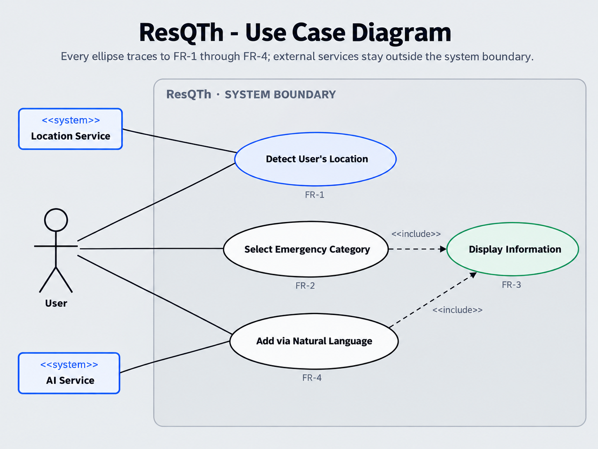
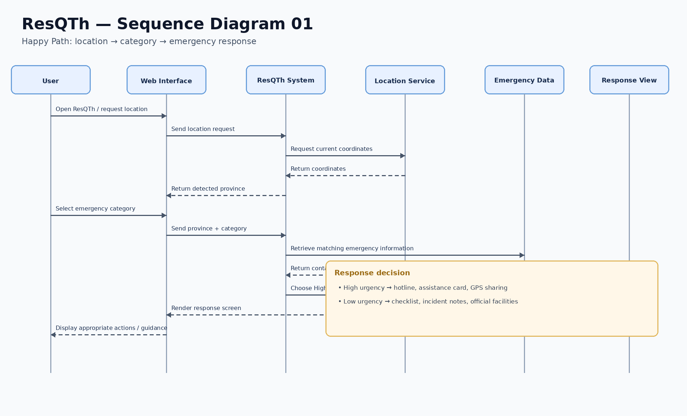
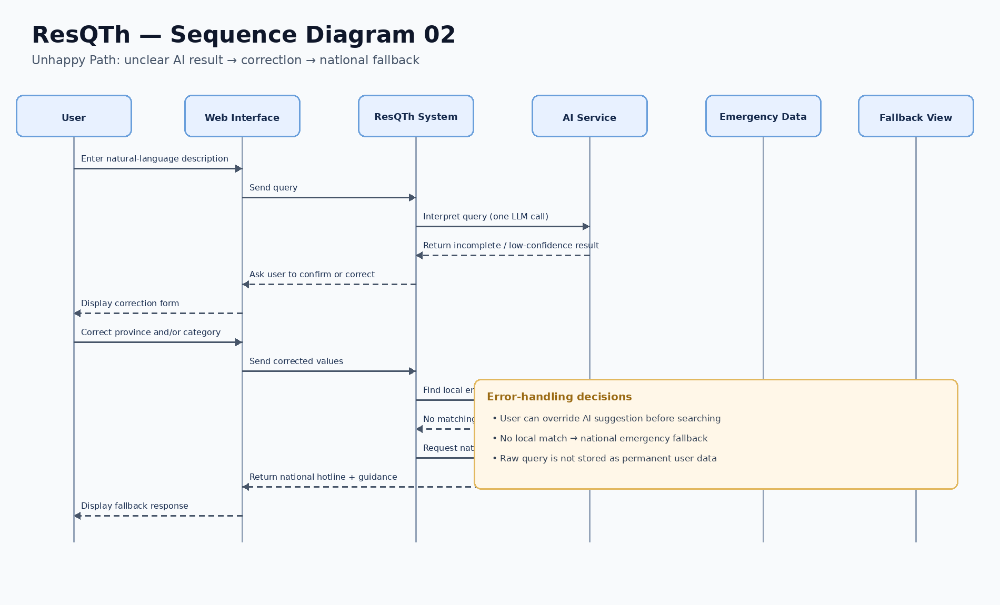

# Design Document: ResQTh

This document contains the **UML diagrams, data model, and UI design / user-flow mapping** for ResQTh.  
The system architecture is documented separately in the `architecture/` folder.

---

## 1. UML Diagrams

### 1.1 Use Case Diagram

The use case diagram shows the scope of the ResQTh MVP and focuses only on the four Must-Have Functional Requirements defined in the SRS.

### Actors / External Systems

- **User** — the primary actor who uses ResQTh during an emergency or post-incident situation.
- **Location Service** — supports location detection so the system can identify the user's province.
- **AI Service** — supports natural-language interpretation for users who describe a situation in their own words.

### Use Cases and SRS Alignment

| Use Case | Related FR | Why it aligns with the SRS |
| :--- | :--- | :--- |
| `UC-01 Detect User's Location` | FR-1 | FR-1 requires ResQTh to detect the user's province automatically, or allow manual province selection when location detection fails. |
| `UC-02 Select Emergency Category` | FR-2 | FR-2 requires the user to select a predefined emergency category so the system can filter the appropriate emergency information and determine urgency. |
| `UC-03 Display Information` | FR-3 | FR-3 requires ResQTh to display the correct response based on urgency, including hotline actions, GPS sharing, checklists, notes, facilities, and national fallback when needed. |
| `UC-04 Add via Natural Language` | FR-4 | FR-4 requires the system to interpret a natural-language description, identify the province/category/urgency, and allow the user to correct the result before continuing. |

The use case diagram intentionally does **not** include account registration, login, payment, chat, or automated emergency dispatch because these functions are outside the ResQTh MVP scope defined in the SRS.

---

### 1.2 Sequence Diagram — Happy Path

The happy-path sequence diagram shows the normal successful flow from obtaining the user's location to displaying the appropriate emergency response.

### Step-by-step Execution

1. The user opens ResQTh and requests or selects a location.
2. The system obtains the user's location and identifies the province.
3. The user selects an emergency category.
4. The client sends the selected province and category to the system.
5. The system retrieves matching emergency information.
6. The system determines whether the situation requires a high-urgency or low-urgency response.
7. The appropriate response is returned and displayed to the user.

### SRS Alignment

- **FR-1** is represented by the location request and province identification.
- **FR-2** is represented by emergency-category selection.
- **FR-3** is represented by information retrieval, urgency handling, and response display.
- The flow keeps the province active while the category is selected, which matches the SRS behavior.

---

### 1.3 Sequence Diagram — Unhappy Path / Error Handling

The unhappy-path sequence diagram shows how ResQTh recovers when the AI result is unclear or when no matching local contact is available.

### Step-by-step Execution

1. The user enters a natural-language description of the situation.
2. The system sends the query for natural-language interpretation.
3. The returned result is incomplete or unclear.
4. The system asks the user to confirm or correct the province and/or category.
5. The user corrects the result.
6. The system searches for emergency information using the corrected values.
7. If no local contact matches the province and category, the system uses the national fallback.
8. The user receives a usable emergency response instead of reaching a dead-end error.

### SRS Alignment

- **FR-4** requires the user to be able to correct an incorrect AI suggestion before searching.
- **FR-3** requires a national emergency hotline fallback when no local contact matches the selected province and category.
- The sequence therefore demonstrates both manual recovery and fallback behavior required by the SRS.

---

## 2. Data Model

The ResQTh data model defines the information needed to support the Must-Have Functional Requirements.

At this design stage, the model is **technology-agnostic**. It describes the information that the system needs without selecting a specific database, framework, or storage technology.

### 2.1 Entity Summary

| Entity | Purpose | Related FR |
| :--- | :--- | :--- |
| `Province` | Represents the province used to localize emergency information | FR-1 |
| `EmergencyCategory` | Represents the type of emergency and its urgency level | FR-2 |
| `EmergencyContact` | Represents emergency hotline/contact information | FR-3 |
| `GuidanceStep` | Represents ordered checklist steps for low-urgency situations | FR-3 |
| `OfficialFacility` | Represents an official place the user may need to visit | FR-3 |
| `IncidentNote` | Represents notes entered during a low-urgency flow | FR-3 |

### 2.2 Entity Specifications

#### Entity: `Province`

| Attribute | Type | Description |
| :--- | :--- | :--- |
| `provinceId` | String | Unique identifier for a province |
| `nameEnglish` | String | Province name in English |
| `nameThai` | String | Province name in Thai |

#### Entity: `EmergencyCategory`

| Attribute | Type | Description |
| :--- | :--- | :--- |
| `categoryId` | String | Unique category identifier |
| `categoryName` | String | Name of the emergency category |
| `urgencyLevel` | String | `High` or `Low` urgency |

#### Entity: `EmergencyContact`

| Attribute | Type | Description |
| :--- | :--- | :--- |
| `contactId` | String | Unique contact identifier |
| `name` | String | Name of the emergency service |
| `phoneNumber` | String | Hotline or contact number |
| `provinceId` | String | Province associated with the contact |
| `categoryId` | String | Emergency category associated with the contact |
| `isNationalFallback` | Boolean | Indicates whether the contact is a national fallback |

#### Entity: `GuidanceStep`

| Attribute | Type | Description |
| :--- | :--- | :--- |
| `stepId` | String | Unique step identifier |
| `instruction` | String | Guidance text shown to the user |
| `stepOrder` | Integer | Display order of the step |
| `categoryId` | String | Related emergency category |

#### Entity: `OfficialFacility`

| Attribute | Type | Description |
| :--- | :--- | :--- |
| `facilityId` | String | Unique facility identifier |
| `name` | String | Name of the official facility |
| `location` | String | Facility location or address |
| `provinceId` | String | Province where the facility is located |
| `categoryId` | String | Related emergency category |

#### Entity: `IncidentNote`

| Attribute | Type | Description |
| :--- | :--- | :--- |
| `noteId` | String | Unique note identifier |
| `content` | String | User-entered incident note |
| `createdAt` | Date/Time | Time the note was created |
| `categoryId` | String | Related emergency category |

### 2.3 Main Relationships

- One **Province** can be related to many **EmergencyContacts**.
- One **EmergencyCategory** can be related to many **EmergencyContacts**.
- One **EmergencyCategory** can have many **GuidanceSteps**.
- One **Province** can have many **OfficialFacilities**.
- One **EmergencyCategory** can have many **OfficialFacilities**.
- One **EmergencyCategory** can be associated with many **IncidentNotes**.

### 2.4 Data-Model Alignment with the SRS

- **FR-1** needs `Province` because emergency information must be localized by province.
- **FR-2** needs `EmergencyCategory` because the user selects a category and the system determines urgency from it.
- **FR-3** needs `EmergencyContact`, `GuidanceStep`, `OfficialFacility`, and `IncidentNote` to support high- and low-urgency responses.
- **FR-4** does not require a permanent `AIQuery` entity. Natural-language input is interpreted into temporary province, category, and urgency values and then reuses the existing model.

---

## 3. UI Design & User Flow

The ResQTh UI is designed to help users reach relevant emergency information quickly, with clear feedback and minimal confusion.

### 3.1 Design System

#### Colors

| Design Token | Usage |
| :--- | :--- |
| Primary Blue | Main actions, location controls, links, and focus states |
| Emergency Red | High-urgency response and urgent status |
| Guidance Green | Low-urgency and post-incident guidance |
| Neutral Gray | Backgrounds, borders, and secondary information |
| White | Main cards and content surfaces |

Color is not used alone to communicate urgency. Text labels such as **Urgent** and **Guidance** are also displayed.

#### Typography

- Large bold headings provide a clear visual hierarchy.
- Body text uses readable sentence case.
- Labels and helper text are separated visually from primary information.
- Buttons use clear action-oriented labels such as **Call 1669**, **Choose Province**, and **Save Note**.

#### Spacing

The UI follows a consistent spacing scale:

**4 / 8 / 16 / 24 / 32 px**

#### Reusable UI Components

- Top navigation bar
- Location card
- Emergency category card
- Natural-language input panel
- Primary and secondary buttons
- Urgency status badge
- Hotline card
- Checklist item
- Official-facility card
- Incident-note field
- Error / fallback alert
- Help panel

---

### 3.2 Accessibility

The prototype applies the course accessibility guidance:

- Sufficient text/background contrast
- Visible keyboard focus
- Interactive targets approximately 44 px or larger
- Labelled form fields
- Semantic HTML controls
- Helpful and understandable error messages
- Urgency shown with text/icons as well as color

---

### 3.3 Nielsen's 10 Usability Heuristics

| # | Heuristic | Application in ResQTh |
| :--- | :--- | :--- |
| 1 | Visibility of system status | ResQTh shows feedback such as detecting location, interpreting input, saving, saved, and error states |
| 2 | Match between system and the real world | Uses familiar terms such as Medical Emergency, Police, Lost Passport, Province, and Call |
| 3 | User control and freedom | Users can go Back, Cancel, Change Situation, or Clear Category |
| 4 | Consistency and standards | Cards, buttons, status styles, spacing, and navigation patterns are reused consistently |
| 5 | Error prevention | AI results are reviewed before use and GPS sharing requires confirmation |
| 6 | Recognition rather than recall | Emergency categories and current context remain visible |
| 7 | Flexibility and efficiency | Users can either select a category manually or use natural-language input |
| 8 | Aesthetic and minimalist design | Uses clear hierarchy, restrained colors, and focused emergency actions |
| 9 | Help users recognize, diagnose, and recover from errors | Location failure, no-local-match, and offline states provide clear recovery actions |
| 10 | Help and documentation | A Help panel explains the basic ResQTh flow |

---

### 3.4 UI-to-Requirement Mapping

| UI Screen ID | Screen / State | Mapped Requirement | Action / Trigger | State Handled |
| :--- | :--- | :--- | :--- | :--- |
| `UI-01` | Home / Location | FR-1 | Detect location or choose province | GPS success / manual fallback |
| `UI-02` | Emergency Category Selection | FR-2 | Select or clear emergency category | Selected category / general-hotline state |
| `UI-03` | High-Urgency Response | FR-3 | Call hotline or optionally share GPS | Immediate emergency response |
| `UI-04` | Low-Urgency Guidance | FR-3 | Follow checklist, add note, view facility | Post-incident guidance |
| `UI-05` | Natural-Language Input | FR-4 | Submit natural-language description | Interpretation / validation |
| `UI-06` | AI Result Review | FR-4 | Confirm or correct province/category | Correct result / manual override |
| `UI-07` | National Fallback | FR-3 | Show national emergency contact | No local contact matched |
| `UI-08` | Offline State | NFR-4 | Use preloaded national hotline/guidance data | Network unavailable |

---

### 3.5 Main User Flows

#### Manual Emergency Flow

**Home → Set Province → Select Emergency Category → Display High/Low-Urgency Response**

#### Natural-Language Flow

**Home → Describe Situation → Review Parsed Result → Correct if Needed → Display Response**

#### Error / Fallback Flow

**No Local Match → National Emergency Fallback**

#### Offline Flow

**Network Failure → Preloaded National Hotlines and Basic Guidance**

---

## 4. Traceability Summary

| Requirement | Main Operation | Main Data | Main UI |
| :--- | :--- | :--- | :--- |
| FR-1 | Detect or manually select province | Province | UI-01 |
| FR-2 | Select / clear emergency category | EmergencyCategory | UI-02 |
| FR-3 | Determine and display appropriate response | EmergencyContact, GuidanceStep, OfficialFacility, IncidentNote | UI-03, UI-04, UI-07 |
| FR-4 | Interpret natural-language input and allow correction | Temporary province/category/urgency values | UI-05, UI-06 |
| NFR-4 | Provide basic emergency information when offline | Preloaded hotline / guidance data | UI-08 |
